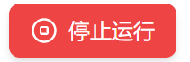

# 项目开发问题记录

## 一、环境配置

### 1.1.安装tailwindcss

之前npm默认安装了最新版本v4，语法有点问题，我卸了。改成了目前主流的tailwindcss@3.4.1

### 1.2.安装zustand

这个版本为@4.5.7。

`useStore(selector, shallow)` 这种传两个参数的写法被**废弃**了，改成了使用 `useShallow` 钩子包裹。

```tsx
//旧版：useStore含2个参数
import {shallow} from 'zustand/shallow';//旧版导入方法

useStore(
    (state) => ({
      ...
    }),
    shallow
  );
//新版：useStore一个参数用useShallow包裹
import {useShallow} from 'zustand/react/shallow';//新版导入方法

useStore(
    useShallow((state) => ({
      ...
    }))
  );
```

之前还默认给我主分支安了个5.0.9的版本，reactflow自己又用一个4.5.7的版本（头大）赶紧退回4.5.7版本了

## 二、Bug记录

### 2.1.节点被选中时闪烁

在我加节点被选中时显示边框时，节点被选中时有时候会闪一下。这是由于`transition-all` 会监听所有 CSS 属性的变化。点击节点时，`ring` 的出现可能会引起极其微小的布局计算（Layout Shift），导致浏览器在绘制时“抖”了一下。

```tsx
// 把 transition-all 改成 transition-shadow
className={`... transition-shadow duration-200 ...`}
```

### 2.2.start节点无法输入

重构时，传参漏传了nodeId，然后随便用了个key，才发现不能输入了

```tsx
//src/components/inspector/StartConfig.tsx
type Props = {
    nodeId: string;
    data: any;
    onChange: (key: string, value: any) => void;
};
```

### 2.3.设计拖拽时报错

- 在我设计工具栏和节点配置面板时，由于默认会提交很多请求，引发报错ResizeObserver loop completed with undelivered notifications.

解决方法：我把拖拽设计成了节流，固定ms请求一次（Stack Overflow的解决方法，针不戳）

```tsx
// 获取当前时间
const now = Date.now();

// 节流
// 只有当距离上次更新超过 20ms时才执行
// 这个频率足够防止ResizeObserver报错
if (now - lastUpdateTime.current < 20) {
	return;
}

// 更新时间戳
lastUpdateTime.current = now;
```

- 我设计了在拖拽时改变鼠标样式，但除了hover，拖拽时显示的都是鼠标悬停在reactflow的小手。原因是计算样式时没添加拖拽手柄的宽度,例如这个工具栏拖拽手柄

```tsx
{/* 左侧：工具箱 */}
<div
  className="relative flex flex-col w-full border-r border-gray-200 shadow-lg"
  style={{ width: sidebarWidth }}
>
  。。。


  {/* 左侧拖拽手柄*/}
  <div
    onMouseDown={startResizeLeft}
    className="absolute top-0 right-0 w-1 h-full cursor-col-resize hover:bg-green-500 transition-colors z-20 group"
  >
  </div>
  。。。
</div>
```

```tsx
// 处理左侧
if (isResizingLeft.current) {
    const newWidth = e.clientX + remToPx(0.25); // 考虑边框宽度
    if (newWidth > 50 && newWidth < 600) {
      setSidebarWidth(newWidth);
    }
}
```

### 2.4.节点运行完后，按钮状态不变

在我的end节点运行结束后，我的一键运行按钮还维持在可停止运行的状态



于是我在end节点的逻辑添加了stopFlow，修改全局状态

```ts
。。。
updateNodeData(nodeId, { status: 'success' });
stopFlow && stopFlow();
```

在store修改isRunning（判断是否正在一键运行的变量）

```ts
stopFlow: () => {
    const { abortController } = get();
    if (abortController) {
        abortController.abort(); // 这一步会触发 fetch 的 reject ('AbortError')
    }
    set({ isRunning: false, abortController: null });
},
```


## 三、代码重构

### 3.1.将代码分到不同文件便于维护

随着功能增加，单文件已经 Hold 不住了。为了长线作战，我把`store.ts`和 `components\NodeInspector.tsx` 逻辑拆分到了  `services`和`components\inspector`里 。（嗯对，就是把那些if-else啥的分出去了）
