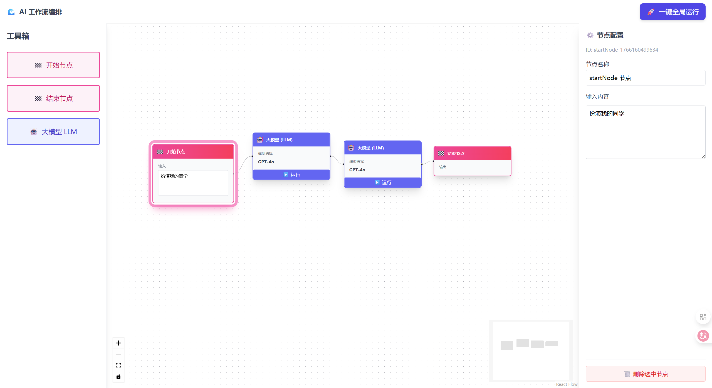

# AI Workflow Editor 🤖

> 一个基于 React Flow 的现代化 AI 工作流编排工具。
> A modern AI workflow editor built with React Flow.

## 📖 简介 (Introduction)

**AI Workflow Editor** 是一个可视化的 AI 流程编排平台。它允许用户通过简单的“拖拉拽”方式构建复杂的 LLM（大语言模型）工作流。

项目采用最新的 **React 19** 和 **TypeScript** 开发，内置了高性能的状态管理和流式数据处理能力。



## ✨ 核心特性 (Features)

* **♾️ 无限画布**: 基于 `ReactFlow` 的可视化操作界面，支持缩放、平移和小地图导航。
* **🖱️ 拖拽编排**: 从侧边栏轻松拖拽 `LLM` 节点到画布，自由连接组件。
* **⚡️ 实时流式响应**: 支持 SSE (Server-Sent Events) 协议，实现打字机效果的实时流式输出。
* **🔗 节点上下文串联**: 智能识别上游节点输出，自动将其作为下游节点的上下文输入，实现多轮对话或逻辑链。
* **🎨 现代化 UI**: 使用 `Tailwind CSS` 构建的清爽界面，内置自定义节点样式和状态指示器。
* **图标库**: Lucide React
* **🧠 状态管理**: 使用 `Zustand` (v4) + `useShallow` 进行高性能的状态管理，避免不必要的重渲染。

## 🛠️ 技术栈 (Tech Stack)

* **Core**: React 19, TypeScript
* **UI Framework**: Tailwind CSS v3.4
* **Flow Engine**: ReactFlow v11
* **State Management**: Zustand v4.5 (w/ useShallow)
* **Build Tool**: Webpack 5

## 🚀 快速开始 (Quick Start)

### 1. 安装依赖

```bash
npm install
```

### 2. 启动开发服务器

```bash
npm start
```

访问 `http://localhost:8080` 查看效果。

### 3. 构建生产版本

```bash
npm run build
```

## 📂 目录结构 (Structure)

```Plaintext
src/
├── components/
│   ├── nodes/       # 自定义节点组件 (LLMNode 等)
│   ├── FlowEditor.tsx   # 画布主组件
│   ├── Sidebar.tsx      # 左侧工具栏
│   └── NodeInspector.tsx # 属性检查器
├── store.ts         # Zustand 状态管理 (核心逻辑)
└── ...
```

## ⚠️ 开发注意 (Notes)

- **Tailwind CSS**: 目前锁定版本为 `3.4.1`，以确保 PostCSS 配置的稳定性。
- **Zustand**: 使用 `useShallow` 钩子进行状态选择，以符合 v4.5+ 的最佳实践。
- **API**: 默认连接 `http://localhost:4000/api/chat`，请确保后端服务已启动。

------

*Created by [Lirenzhiling]*