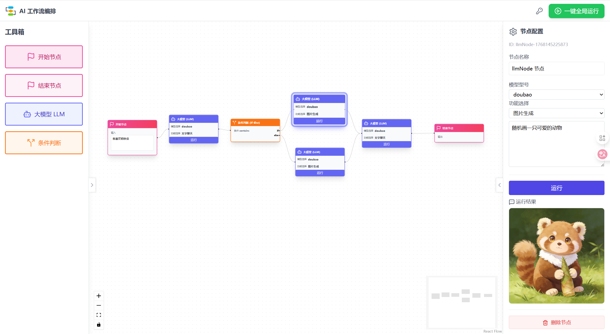

# 🤖 AI Workflow Editor 使用手册

欢迎使用 **AI Workflow Editor**！这是一个基于最新 React 技术的现代化 AI 工作流编排平台。在这里，您可以通过简单、直观的“拖拉拽”操作，像搭积木一样构建复杂的 LLM（大语言模型）应用。

无论您是开发者还是 AI 爱好者，希望这份文档能成为您探索 AI 世界的得力助手。✨

------

## 🌟 项目亮点

在这个版本中，我们为您准备了以下贴心的功能：

- **♾️ 无限画布体验**：基于 `ReactFlow` 打造，您可以随意缩放、平移画布，甚至通过小地图快速导航，不用担心空间不够用。
- **🖱️ 轻松拖拽编排**：只需从侧边栏将节点拖入画布，即可通过连线将它们串联起来。
- **⚡️ 沉浸式流式响应**：支持 SSE 协议，像与真人对话一样，看着文字一个个跳动出来（打字机效果）。
- **🧠 智能上下文串联**：系统会自动识别上游节点的输出，并将其作为“记忆”传递给下游节点，非常适合搭建多轮对话或逻辑链。
- **🎨 清爽的界面设计**：使用 Tailwind CSS 精心调配的现代化 UI，配合 Lucide 图标库，视觉体验舒适。



------

## 🚀 快速上手 (Quick Start)

让我们开始这段旅程吧！请确保您的电脑上已经安装了 Node.js 环境。

### 1. 获取项目与安装依赖

首先，请在终端中运行以下命令来安装项目所需的依赖包：

Bash

```
# 安装项目依赖
npm install
```

### 2. 启动开发环境

依赖安装完成后，您可以启动本地开发服务器，实时预览效果：

Bash

```
# 启动开发服务器
npm start
```

启动成功后，请在浏览器中访问 `http://localhost:8080`。

> **温馨提示**：项目默认会连接 `http://localhost:4000/api/chat` 的后端服务。请别忘了启动您的后端服务，以确保 AI 对话功能正常运行哦。

### 3. 构建生产版本

如果您需要部署项目，可以使用以下命令进行构建：

Bash

```
# 构建生产环境代码
npm run build
```

------

## 📖 操作指南

进入编辑器后，您可以尝试以下操作：

1. **创建节点**：在左侧的 **Sidebar** (侧边栏) 中找到 `LLM` 节点，按住鼠标左键将其拖拽到中间的画布上。
2. **连接逻辑**：每个节点都有输入和输出的连接点（Handle）。点击一个节点的输出点，拖动线条连接到另一个节点的输入点，即可建立上下文关系。
3. **调整视图**：
   - **缩放**：滚动鼠标滚轮可以放大或缩小画布。
   - **移动**：按住画布空白处拖动，可以平移视图。
4. **实时交互**：配置好节点后，触发运行，您将看到 AI 的回复以流式打字机的效果呈现在节点中。

------

## 🛠️ 技术详情 (For Developers)

如果您对项目的底层实现感兴趣，以下是我们使用的核心技术栈：

- **核心框架**: React 19 + TypeScript (拥抱最新技术标准)
- **UI 框架**: Tailwind CSS v3.4 (高效的样式构建)
- **流程引擎**: ReactFlow v11 (强大的可视化库)
- **状态管理**: Zustand v4.5 (配合 `useShallow` 实现高性能渲染)
- **构建工具**: Webpack 5

### 目录结构参考

```
src/
├── components/
│   ├── nodes/        # 自定义节点组件 (如 LLMNode)
│   ├── FlowEditor.tsx    # 画布核心组件
│   ├── Sidebar.tsx       # 侧边栏组件
│   └── NodeInspector.tsx # 属性配置面板
├── store.ts          # Zustand 状态管理逻辑
└── ...
```

------

## ⚠️ 开发注意事项

为了保证项目的稳定运行，我们在开发中做了一些特别的设定，请您留意：

- **关于样式**：我们将 `tailwindcss` 锁定在 version 3.4.1，这是为了确保 PostCSS 配置的稳定性，建议不要随意升级此依赖。
- **关于状态管理**：在使用 Zustand 时，我们采用了 v4.5+ 推荐的 `useShallow` 钩子来进行状态选择，这能有效避免不必要的组件重渲染，保持应用流畅。